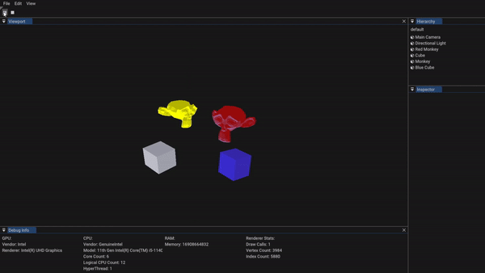

# Eve Engine Source Tree

# Screenshots

## Table Of Contents:
  - [BUILDING](./BUILDING.md)
  - [CODE_STYLE](./CODE_STYLE.md)

## Features:
- Editor application
- Asset and serialization system
- C# Mono scripting
- ECS scene system
- Dynamic batch renderer
- Event and input system