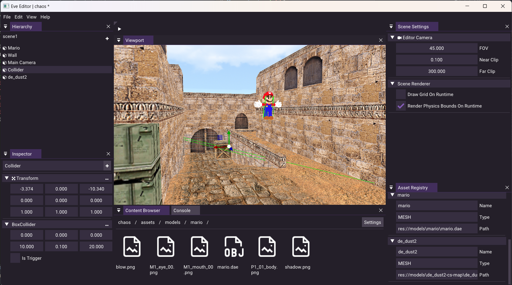

# Eve Engine Source Tree

# Screenshots

## Building
  Please refer to [BUILDING](./BUILDING.md) for detailed information.

## Code Style
  We try to use google style persistently, for more information please refer to [CODE_STYLE](./CODE_STYLE.md)

## Features:
- Editor application
- Asset and serialization system
- C# Mono scripting
- Custom physics engine.
- ECS scene system
- Dynamic batch renderer
- Event and input system